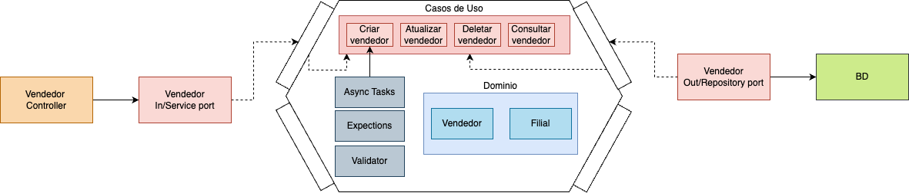

# desafio_backend_cb
## Arquitetura
Foi utilizado como base a arquitetura hexagonal



## Arquitetura
Utilizado Java 17.

## Como subir
Utilizar o comando
```console
docker compose up --build
```
Na endereço http://localhost:8080/ tera acesso aos endpoints.
No endereço http://localhost:9090/ tera acesso aos dados de observabilidade da api.

## Métodos
Requisições para a API devem seguir os padrões:
| Método | Descrição |
|---|---|
| `GET` | Retorna informações de um ou mais registros. |
| `POST` | Utilizado para criar um novo registro. |
| `PUT` | Atualiza dados de um registro ou altera sua situação. |
| `DELETE` | Remove um registro do sistema. |

### Listar vendedores [GET /sellers]

+ Response 200 (application/json)

        [{
        "id": "1-CLT",
        "name": "Name1",
        "birthDate": "2021-09-17",
        "cpfCnpj": "761.940.010-97",
        "email": "email@email.com",
        "hiringType": "CLT",
        "branch": {
            "id": 1,
            "name": "Branch1",
            "cnpj": "123123123123",
            "city": "Sao Paulo",
            "uf": "SP",
            "type": "type1",
            "active": true,
            "registrationDate": "2021-09-17T18:47:52.69",
            "lastUpdate": "2021-09-17T18:47:52.69"
            }
        },...]

### Listar vendedor [GET /seller/{id}]
+ Parameters
    + id (required, number) Id do vendedor
+ Response 200 (application/json)
+ 
        {
        "id": "1-CLT",
        "name": "Name1",
        "birthDate": "2021-09-17",
        "cpfCnpj": "761.940.010-97",
        "email": "email@email.com",
        "hiringType": "CLT",
        "branch": {
            "id": 1,
            "name": "Branch1",
            "cnpj": "123123123123",
            "city": "Sao Paulo",
            "uf": "SP",
            "type": "type1",
            "active": true,
            "registrationDate": "2021-09-17T18:47:52.69",
            "lastUpdate": "2021-09-17T18:47:52.69"
            }
        }

### Buscar task de criação de vendedor [GET /status/{id}]
+ Parameters
    + id (required, string) Id da task
+ Response 200 (application/json)
+ 
        {
        "status": "COMPLETED",
        "message": "",
        "id": "3c461ffe-f970-4127-9287-d99965cc39cf",
        "sellerId": 4
        }

### Criar vendedor [POST /seller]

+ Attributes (object)

    + nome (string, required)
    + birthDate (Date, optional)
    + cpfCnpj (string, required)
    + email (string, required)
    + hiringType (string,required, options:{"CLT", "Pessoa Juridica", "Outsourcing"})
    + branchId (int, required)

+ Request (application/json)
  
    + Body

            {
            "name": "Nome",
            "birthDate": "2021-09-17",
            "cpfCnpj":"59.155.294/0001-73",
            "email":"a@.com",
            "hiringType":"Pessoa Juridica",
            "branchId":2
            }   


+ Response 201 (application/json)

    + Headers

            Location: /status/{id da task de criação}

    + Body

            {
            "status": "CREATED"
            }


### Atualizar vendedor [PUT /seller/{id}]

+ Parameters
    + id (required, number) Id do vendedor
  
+ Attributes (object)

    + nome (string, required)
    + birthDate (Date, optional)
    + cpfCnpj (string, required)
    + email (string, required)
    + hiringType (string,required, options:{"CLT", "Pessoa Juridica", "Outsourcing"})
    + branchId (int, required)

+ Request (application/json)
  
    + Body

            {
            "name": "Nome",
            "birthDate": "2021-09-17",
            "cpfCnpj":"59.155.294/0001-73",
            "email":"a@.com",
            "hiringType":"Pessoa Juridica",
            "branchId":2
            }   


+ Response 200 (application/json)

    + Body

            {
            "status": "OK"
            }
+ Response 500 (application/json)

    + Body

            {
            "timestamp": "2024-04-01T21:15:06.439+00:00",
            "status": 500,
            "error": "Internal Server Error",
            "message": "Sellers with PJ hiring type should use the CNPJ document and other should use the CPF document",
            "path": "/seller/1"
            }


### Deletar vendedor [DELETE /seller/{id}]
+ Parameters
    + id (required, string) Id do vendedor
+ Response 200 (application/json)
+ 
        {
        "status": "OK"
        }